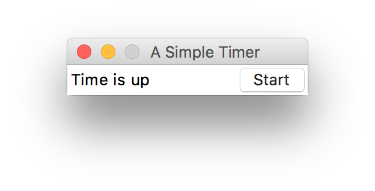
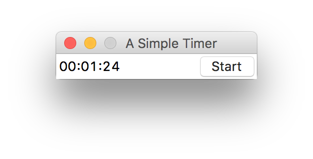

# A Simple Timer

A very simple countdown timer for video essay practices in Grad school application.

## Dependencies

System: `macOS`. Python version: `3.x`. Packages: `tkinter`.

## Usage

1. In the script you may change the time length `N`, which is now fixed to 90 for convenience. You can also add an input prompt in the loop if you would like to change time every time.

2. In Terminal,

```{bash}
python timer.py
```

3. You can now (re)start the timer, which will set off a system alarm when time's up.


